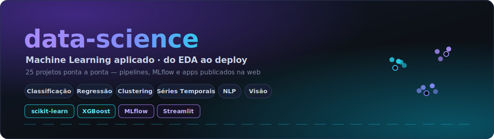

# 📊 Data Science & Machine Learning — Alan Joffre

Repositório de **Data Science e Machine Learning aplicado** — projetos ponta a ponta de classificação, regressão, clusterização, séries temporais, NLP e visão computacional, do EDA ao deploy. *(Applied ML portfolio: end-to-end projects from EDA to deployment.)*

> 💼 Sou **Data Engineer · Analytics Engineer · AI Engineer** — esta é minha base de ML aplicado. Veja também a plataforma de dados [**toll-analytics-platform**](https://github.com/alanjoffre/toll-analytics-platform) e o projeto de Engenharia de IA de ponta a ponta [**RodoIA**](https://github.com/alanjoffre/rodoia) (RAG · fine-tuning · agente · MLOps).

---

## 🗂️ Organização

| Pasta | Conteúdo |
|---|---|
| [`projetos/`](projetos/) | Projetos práticos (detalhados abaixo) |
| [`curso-didaticatech/`](curso-didaticatech/) | Estudos de Machine Learning e Deep Learning |
| [`base-de-conhecimento/`](base-de-conhecimento/) | Anotações e checklists de tratamento/treino |

---

## 🚀 Projetos em destaque

### 🚚 Logística & Transporte — [`projetos/logistica_transporte/`](projetos/logistica_transporte/)
Série de 13 projetos sobre mobilidade urbana (dados de viagens):
previsão de gorjeta (regressão), classificação de compartilhamento, **clusterização de séries temporais** (K-Shape/DBSCAN + Optuna + MLflow), **detecção de anomalias** em tarifas, análise geoespacial, otimização de rotas, previsão de demanda com redes neurais e gestão de frota.

### 🧠 Projeto de Ciência de Dados completo — [`projetos/ciencia-de-dados-completo-real-2024/`](projetos/ciencia-de-dados-completo-real-2024/)
Pipeline real de ponta a ponta: EDA → limpeza → modelagem → **explicabilidade (XAI)** → **API** → **deploy**.

### 💳 Detecção de Fraude em Cartão — [`projetos/creditcard_fraud_detection/`](projetos/creditcard_fraud_detection/)
Classificação com forte desbalanceamento (imbalanced-learn), preparada para escorar em lote (PySpark) e streaming (Kafka).

### 💬 Análise de Sentimentos (NLP em escala) — [`projetos/analise-de-sentimentos/`](projetos/analise-de-sentimentos/)
Pipeline de NLP processando **10M+ linhas** com Dask (paralelo), inviável em pandas single-node.

### 👥 Segmentação de Clientes — [`projetos/segmentacao_de_clientes_clustering/`](projetos/segmentacao_de_clientes_clustering/)
Clusterização (KMeans) com Spark e Kafka para segmentação e estratégia.

### 📉 Rotatividade de Clientes (Churn) — [`projetos/rotatividade-de-clientes/`](projetos/rotatividade-de-clientes/)
Previsão de churn com SMOTE e boosting; ~85% de acurácia.

### 👁️ Visão Computacional
- [`reconhecimento_facial_e_deteccao_de_objetos/`](projetos/reconhecimento_facial_e_deteccao_de_objetos/) — reconhecimento facial + detecção de objetos (YOLO, OpenCV, Flask).
- [`reconhecimento_optico_de_caracteres_tesseract/`](projetos/reconhecimento_optico_de_caracteres_tesseract/) — OCR com Tesseract.

### 📈 Previsão de Mercado — [`projetos/previsao_de_mercado_de_acoes/`](projetos/previsao_de_mercado_de_acoes/)
Previsão de câmbio USD/BRL (Random Forest, XGBoost, LSTM) com dados do Yahoo Finance.

### 🖥️ 14 Apps de IA com Streamlit — [`projetos/streamlit-12-aplicacoes-inteligencia-artificial/`](projetos/streamlit-12-aplicacoes-inteligencia-artificial/)
Aplicações web publicadas: regressão, classificação, séries temporais, sistemas de recomendação, IA generativa, EDA de dados públicos, otimização com algoritmos genéticos e mais.

---

## 🛠️ Stack
`Python` · `Pandas` · `NumPy` · `scikit-learn` · `XGBoost` · `LightGBM` · `SHAP/LIME` · `MLflow` · `Optuna` · `Dask` · `PySpark` · `Kafka` · `spaCy/NLTK` · `OpenCV/YOLO` · `Streamlit` · `Flask`

## ▶️ Como usar
Cada projeto tem sua própria pasta com notebooks/scripts e (quando aplicável) `requirements.txt`. Abra a pasta do projeto de interesse e siga o notebook principal.

---

© 2026 Alan Joffre · <a href="https://github.com/alanjoffre">github.com/alanjoffre</a> · <a href="https://linkedin.com/in/alanjoffre">LinkedIn</a>

